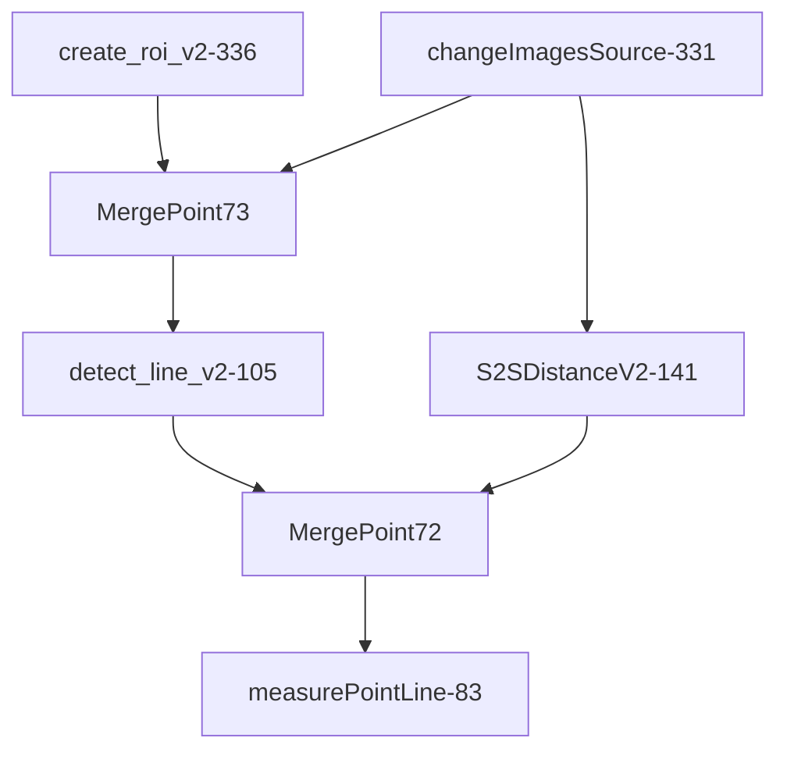
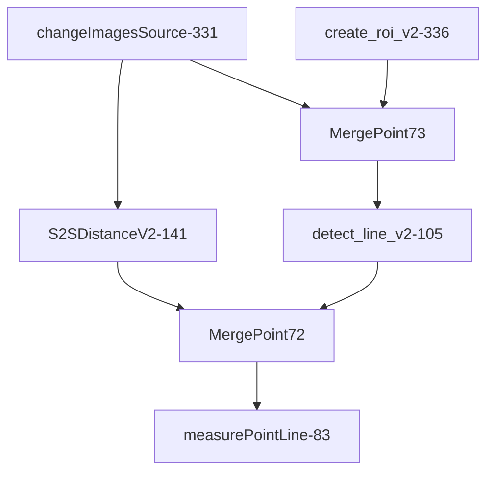

```mermaid
graph TD
create_roi_v2-336 & changeImagesSource-331 --> MergePoint73
MergePoint73 --> detect_line_v2-105
changeImagesSource-331 --> S2SDistanceV2-141
detect_line_v2-105 & S2SDistanceV2-141 --> MergePoint72
MergePoint72 --> measurePointLine-83
```

```mermaid
graph TD
changeImagesSource-331 --> S2SDistanceV2-141
changeImagesSource-331 & create_roi_v2-336 --> MergePoint73
MergePoint73 --> detect_line_v2-105
detect_line_v2-105 & S2SDistanceV2-141 --> MergePoint72
MergePoint72 --> measurePointLine-83
```

