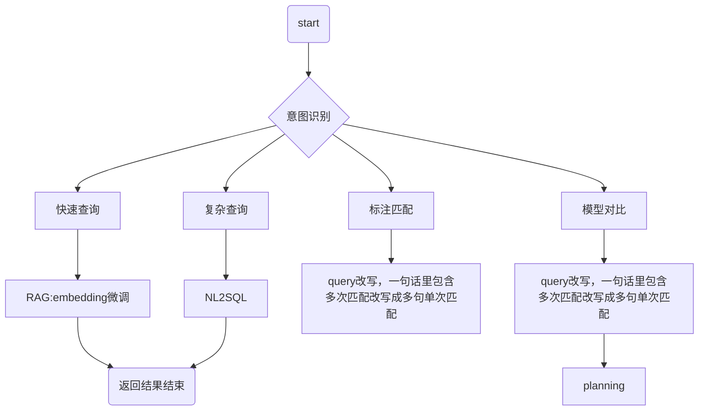

# 准确率

1. 从小更换到大模型，小模型往往无法准确依照langchain的回答框架进行回答。即便最好的模型也无法回答所有的sql问题
2. 


# 合成数据

1. 优先选择云端的大模型进行生成答案

2. 逐步修改prompt引入额外信息，统计生成最终答案的步骤，选择更好的prompt

3. 人工挑选原则，合并云端大模型的数据和本地中等模型的数据

4. 在相同的问题的回答里构造更加简单的回答方案（人工）

5. 在相同的问题回答里对不同的云端模型的答案进行排序

6. 两种类型的构造数据

   6.1 简单场景的数据，有简单的描述，数据库的schema，和快速的回答。方便后续的embedding训练和简单的RAG训练，同时也能作为微调小模型的语料

   6.2 完整react的prompt数据，用于调整小模型查询复杂的数据


# 提高速度

1. 提前输入表结构信息

2. few-shot里提供更多复杂sample

3. 使用prefix和suffix的参数提供更多信息

   ```python
   def create_agent(self):
       # 自定义的前缀（会添加到默认 prompt 之前）
       custom_prefix = """你是一个专业的数据库查询助手。
   
   重要规则：
   1. 在查询表结构时，必须使用正确的格式：Action Input: 表名1, 表名2
   2. 每次只执行一个 Action，等待 Observation 后再继续
   3. 不要自己编造 Observation，必须等待真实的工具执行结果
   4. 表名之间用逗号和空格分隔，不要有换行符
   
   以下是原始指令：
   """
       
       # 自定义的后缀（会添加到默认 prompt 之后）
       custom_suffix = """
   记住：严格按照 Action -> Observation -> Thought 的循环执行，不要跳步！
   
   开始！
   Question: {input}
   Thought: {agent_scratchpad}
   """
       
       return create_sql_agent(
           llm=self.llm,
           db=self.db,
           agent_type=AgentType.ZERO_SHOT_REACT_DESCRIPTION,
           verbose=True,
           handle_parsing_errors=True,
           max_iterations=10,
           prefix=custom_prefix,      # 添加自定义前缀
           suffix=custom_suffix,      # 添加自定义后缀（可选）
       )
   ```

   


## 自定义工具

1. 修正不同模型的错误返回，例如多余的字段等
2. 


## 意图识别模型

1. 为什么使用CLM小模型，数据库小，意图数量少，
2. 


### 框架流程图




